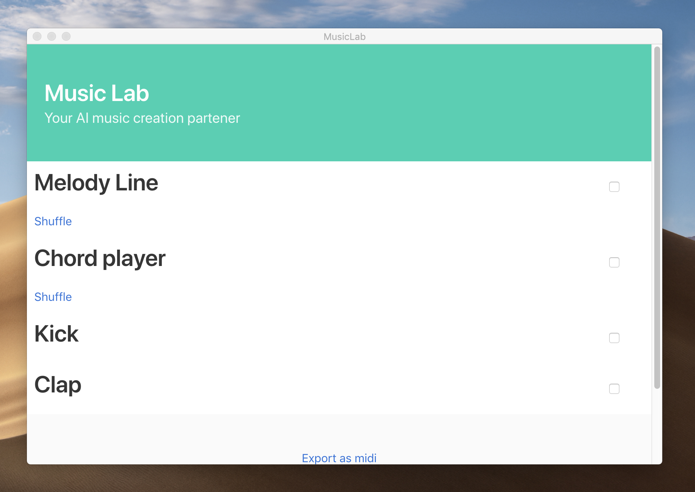

# musicLab



AI Music making, yes another one.

This is an electron application. So if you would like to try it out make sure you have the following requirements and check the [install section](#Install)

Requirements:
1. Node.js(NPM)

## How it works.

Music Lab is a melody generator based on Markov chains. If you want to see what it is capable of check one of our rendered tracks [here](https://github.com/pedsm/musicLab/tree/master/polished_mp3s)

## How to use it

### Install:

1. Mac:

Just download the latest release from [here](https://github.com/pedsm/musicLab/releases) and run it

2. Windows and Linux:

I did not have time to compile OS specific versions of MusicLab but you can clone the repo and run the following to compile and execute from source.
```
npm install
npm start
```
Hopefully, it will work

### Using the software

Music lab comes with a synth to preview your melodies. However it is not the greatest sounding synth, you can use it as you want but I recommend you do the following:

1. Once the software is open just check the boxes on the right of `melody` and `chords` in order to hear the generated melody over a simple chord progression. Ignore the kick and clap as they are there just placeholders, and are not AI based.

2. Click the shuffle button until you are happy with a melody and chord progression. (As the melody keeps in key and never stops playing you may not notice that the melody has changed but it has)

3. Scroll to the bottom and export your creation as MIDI.

4. From there you can open those MIDI files in any compatible software such as garage band and add some proper instruments to it.

### A in-depth explanation

To implement a Markov chain to the process we abstracted two of the core concepts of a melody.

1. Notes
2. Rhythm 

**Notes**

A melody is a series of notes played in relationship to a root note. So in order to create a model and then apply this model MusicLab analyses a series of notes as MIDI values(integers) and measures the distance between the note played and the previous note. A model number of 0 means that the same note is being played, while a model number of 1 means that we are now playing one note higher than the previous note. By applying this to our learning sample, in this case, the main melody line to the Game of Thrones we get our model. We get something along the lines of:

```json
[0,-7,3,2,2,-7,3,2,2,-7,3,2,2,-7,3,2,2, ...]
```

The overly simplified way that our Markov chain works is by picking a random number in this model(Array). What this leads to is that MusicLab will learn the frequency between intervals. For example, if a single semitone up from the previous note is never played then MusicLab will never play that. However, if there is a constant use of `+7`(Fifth note) or `+12`(One octave higher) then it will play those patterns more often.

**Rythm**

Music lab applies the exact same concept to the rhythm. This means how long notes should last and if they should play at all. Unfortunately due to this being build in 24 hours. We cheated and I just hardcoded our rhythm model. Our model looks like this.

```javascript
const model = ['0:1', '0:1', '0:1', '0:1', '0:1', '0:2']
```

A `0:1` means play for a quarter of a beat meanwhile a `0:2` means play for half a beat. As the model is laid out it will play `0:1`s five times more often than it will play `0:2`s. However, the idea of using a model is still valid and given more time this could be automated to learn from midi files.

## Why it works so well(at least I think it does)?

There was a massive oversight by my part while developing this project which lead me to `cheat` once more to get this done in the time frame that we had. The concept of using Markov for this is theoretically correct. However, there is one key difference you may have caught if you were paying attention.

As I said before:

> A melody is a series of notes played in relationship to a root note.

However, if you look carefully there is no mention of the root note in our model, but rather a relationship to the previous note. *This breaks everything*.

If you have no background in music theory let me explain. When writing music we usually adhere to a scale, a scale is a series of notes that sound good together(yes this definition is very broad but stick with me). A scale can be created by applying the scale pattern to any note. This is called transposing. In the classic western tuning, we have 12 notes(or semitones).

For a quick demonstration why this is flawed let's create a simple made-up scale pattern of `[0, 1, 2, 5, 7]`. Then let's start at the MIDI note 60. This would give us the following MIDI notes as valid scale notes in one octave `[60, 61, 62,65, 67]`. Ok, all good so far. That would mean that playing any of these notes in any random order would conform to the scale. Now image this is the source for our model.

> Notes played: `[60, 62, 65]`
> Model created: `[0(60-60), 2(62-60), 3(65-62)]`

If we start creating a melody by picking values from this model then what we could eventually end up with something like: `[0,2,2,2]`. Once we then apply this to any route note lets pick 60 once more we get `[60,62,64,66]`. Oops if you were paying attention you would realise that we are not playing the notes in the scale anymore.

By doing such a short and biased lookup and only considering the previous note rather than the relationship to the root note we now have lost a lot of contexts, and this break my whole approach.

**The fix**

The fix is less than an elegant solution, but it is a working one. The point of this project may a remind you is to generate random melodies which sound good. Not create a super complex system which will be musically smart as a human being. So the fix was dirty and simple. Instead of taking the input of `[0,2,2,2]` and reverse engineering the notes. I map the relative positions of those to a common western scale. Right now the major scale

```javascript
const s = scale('major').map(transpose(baseNote))
```

What this means is that we are not learning as much as we can and there is a major limitation in the software as it will only make melodies on a single scale. Unless the method by which the model is created is drastically modified. However, it works so it is fine for now.